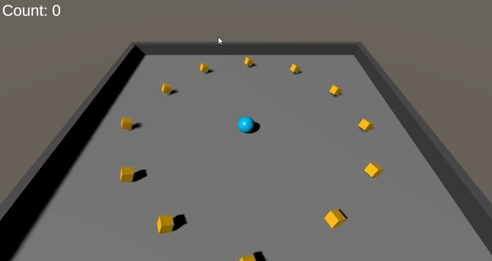

# Top Priorities

## Pickup Animation

This was a bit tricky. A challenge. Apparently it's a problem of local and global rotation.

I read the docs throughly and found these methods:

* [`rotate(Vector3 axis, float angle)`](https://docs.godotengine.org/en/latest/classes/class_node3d.html#class-node3d-method-rotate) - Rotates the local transformation around axis, a unit Vector3, by specified angle in radians.
* [`rotate_object_local(Vector3, float)`](https://docs.godotengine.org/en/latest/classes/class_node3d.html#class-node3d-method-rotate-object-local) - Rotates the local transformation around axis, a unit Vector3, by specified angle in radians. **The rotation axis is in object-local coordinate system**.

I'm not sure I understand it completely, but I got it working. Using `rotate` I got the same result as before, but using `rotate_object_local` I got the desired result.

This is the final code (for now):

```gdscript
extends CharacterBody3D

@onready var mesh_instance_3d : MeshInstance3D = $MeshInstance3D

var rotation_speed : float = 0.8


func _ready() -> void:
	pass


func _process(delta: float) -> void:
	mesh_instance_3d.rotate_object_local(Vector3(1, 0, 0), 1 * delta * rotation_speed)
	mesh_instance_3d.rotate_object_local(Vector3(0, 1, 0), 2 * delta * rotation_speed)
	mesh_instance_3d.rotate_object_local(Vector3(0, 0, 1), 3 * delta * rotation_speed)
```

It became clear that I need to understand the difference between local and global coordinates. I'll do some research on that in the future.

## Improving the lighting

Unity's lighting:


Godot's lighting:


Looking at these, it seems to me that the Godot's lighting is not only brighter, but also prettier.

Anyway, I'll try to darken it a bit.

So, for starters, I reduce the `DirectionalLight3D`'s `energy` to `0.5`.

The result:


Closer, but still off.

So I changed the `DirectionalLight3D`'s `color` to 200 200 200.

The result:


Still not there, but I think it's good enough for now.

## Refactoring the Pickup collect

I don't believe the Pickup needs to be a `CharacterBody3D` node and have the Player checking for collisions (which requires the collision layer hack). My goal is to make a more lightweight solution, using the most appropriate node(s) for the job.

This sounds like it'll be a fun thing to do.

But first, some thoughts:

* The Player have to to be a `RigidBody3D` node. It makes the physics work easily, pushing it around, having it fall, collide with other objects, etc.
* There are three types of [PhysicsBody3D](https://docs.godotengine.org/en/latest/classes/class_physicsbody3d.html#class-physicsbody3d) nodes:
  * [RigidBody3D](https://docs.godotengine.org/en/latest/classes/class_rigidbody3d.html#class-rigidbody3d): which is moved by 3D physics simulation. Useful for objects that have gravity and can be pushed by other objects.
  * [CharacterBody3D](https://docs.godotengine.org/en/latest/classes/class_characterbody3d.html#class-characterbody3d): special types of bodies that are meant to be user-controlled
  * [StaticBody3D](https://docs.godotengine.org/en/latest/classes/class_staticbody3d.html#class-staticbody3d): which is static or moves only by script. Useful for floor and walls.

The closest class appropriate for the `Pickup` would be the `StaticBody3D`, but even so it would be a bit of a stretch. It may be static but it's not a wall, it's not a floor. It's a collectible item.

The only thing I need for it is to check if the Player is overlapping the Pickup. I don't need any physics simulation at all for that.

Now, let's consider what the docs say about [Areas 3D](https://docs.godotengine.org/en/latest/classes/class_area3d.html):

> "3D area that detects CollisionObject3D nodes overlapping, entering, or exiting."

Since [CollisionObject3D](https://docs.godotengine.org/en/latest/classes/class_collisionobject3d.html#class-collisionobject3d) is inherited by Area3D and PhysicsBody3D, it means it will detect overlap with `Rigidbody3D`, `CharacterBody3D`, `StaticBody3D` and also other `Area3D` nodes.

Sounds good for me!

So the first step was to open the `Pickup` scene and right click on the root node (a `CharacterBody3D` named `Pickup`) and select the `Change Type` command, select `Area3D` and confirm the change.

Then, on the attached script, I changed the `extends` declaration from `CharacterBody3D` to `Area3D` as well.

```gdscript
extends Area3D # <- changed from CharacterBody3D
(...)
```

I also reenabled the Collision Layer 1 on `Pickup`, removing the hack I did before.

Now, running the game, I can see that nothing happens when the Player overlaps the Pickup. That's expected, since I haven't added any code to handle the overlap.

The reason for that can be seen on the doc of (body_entered)[https://docs.godotengine.org/en/latest/classes/class_rigidbody3d.html#class-rigidbody3d-signal-body-entered] signal:

> Emitted when a collision with another PhysicsBody3D or GridMap occurs.

Pickup is not a `PhysicsBody3D` anymore, so it won't emit the signal. But the `Player` is still a `RigidBody3D`.

So one way to fix it, since `body_entered` only detects PhysicsBody3D or GridMap, would be to make the `Pickup` detect the overlap and call a method on the `Player` to handle the collect, or maybe emit a custom signal that the `Player` would listen to.

However, I don't like that solution. It makes more sense to me to have the `Player` detect the overlap and handle the collect.

How to fix that?

The `Area3D` class has a signal called `area_entered` that is emitted when a `PhysicsBody3D` or `Area3D` enters the area.

So the `Player` can have an `Area3D` node attached to it as well, and listen to the `area_entered` signal.

Although it might seem that adding a `Area3D` node to the `Player` is excessive (and it'll required another `CollisionShape3D` as well), I'm actually planning ahead: in the future, I intend to expand the pickup area and have the `Player` collect the pickups by just being near them, without having to touch them. That'll allow me to add cool effects like a "magnet" animating the pickups being collected.

For now, I'll just add the `Area3D` node to the `Player` root node, rename it as `PickupArea3D`, copy and paste the `CollisionShape3D` as a child of it - it'll be the same shape as the Sphere for now - and listen to the `area_entered` signal.

```gdscript
(...)

# Added a reference to the PickupArea3D node
@onready var pickup_area_3d: Area3D = $PickupArea3D

(...)


func _ready() -> void:
	# Added the signal connection
	pickup_area_3d.area_entered.connect(_on_area_entered)

(...)

# Renamed the method from body_entered to area_entered
func _on_area_entered(body : Node) -> void:
	if body.is_in_group("pickups"):
		count += 1
		set_count_text()
		body.queue_free()
```

Now, running the game, I can see that it works just like before, but without the collisiong layer hack, and with a Pickup `Area3D` that will be useful in the future.

## Refactoring the Win condition

The way that Unity's tutorial handles the win condition is by comparing the count variable with a hardcoded value.

That'll be a problem if I add or remove pickups to the scene. Updating the hardcoded value is not a good solution.

It would be better if I could just check if there are any pickups left in the scene.

Since we added the Pickups to the `pickups` group, it turns out that Godot has a method that's perfect for that: [get_nodes_in_group](https://docs.godotengine.org/en/latest/classes/class_scenetree.html#class-scenetree-method-get-nodes-in-group).

So instead of comparing the count with a hardcoded value, I can store the number of pickups in the scene in a variable and compare it with the count.

```gdscript
var total_pickups : int

(...)

func _ready() -> void:
	# Counting the pickups in the scene
	total_pickups = get_tree().get_nodes_in_group("pickups").size()

func set_count_text() -> void:
	(...)

	if count >= total_pickups: # <- removed hardcoded value
		win_label.visible = true
```
