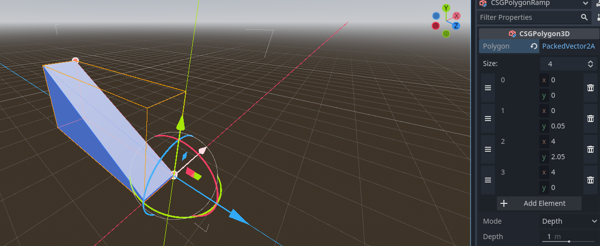
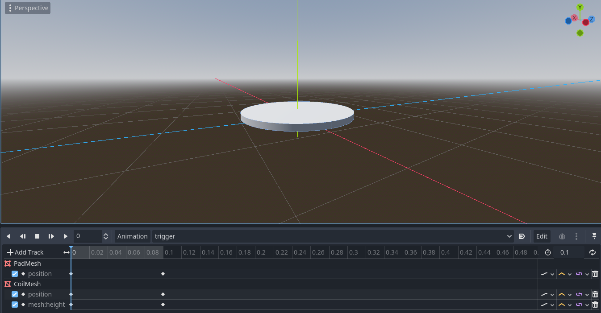
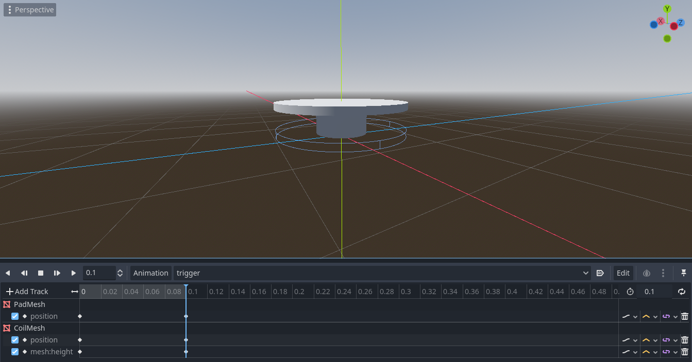
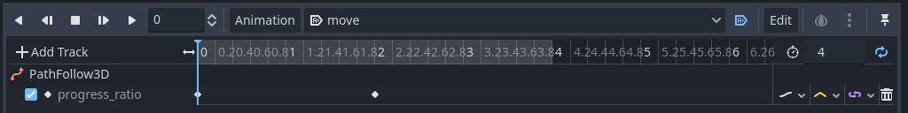
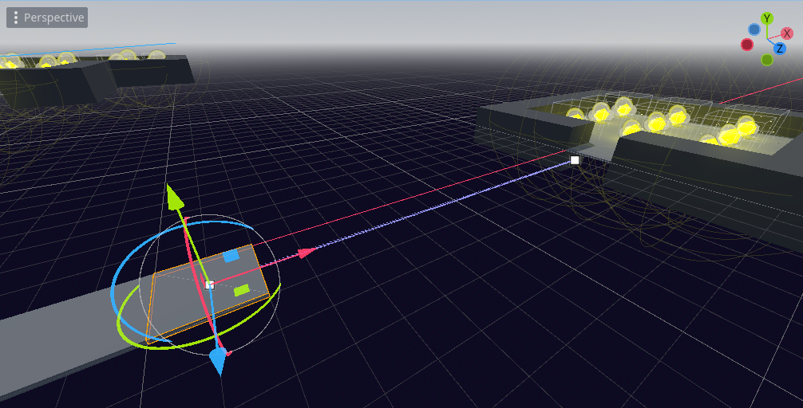
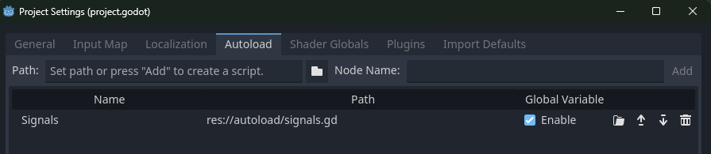

# Low priorities

## Add a `Ramp` to create verticality on level design

After learning that it's not possible to add [CSG nodes to a Gridmap](https://www.reddit.com/r/godot/comments/ovfh6y/am_i_able_to_make_a_gridmap_with_csg_nodes/), even though it's possible to create it using other methods, I decided to just create a CSGPolygon and use it as a ramp.



## Add a `Coil` object that launches the player in the air for more verticality

I wanted something very simple: an `Area3D` that detects the `Player` and launches it in the air.

I created a `Coil` scene with an `Area3D` as root and a `CollisionShape` as children. I also added two MeshInstances, PadMesh and CoilMesh, to make it look like a coil.

I set all of their meshes and shape as Cylinders, and set their radius, height and transform as needed.

Finally I added an `AnimationPlayer` to the `Coil` scene and attached a script to the root node.

```gdscript
extends Area3D

@onready var animation_player: AnimationPlayer = $AnimationPlayer

@export var force: int = 800


func _ready() -> void:
	body_entered.connect(_on_body_entered)


func _on_body_entered(body: Node3D) -> void:
	if body.name == "Player":
		body.apply_central_force(Vector3.UP * force)
		animation_player.play("trigger")
		animation_player.queue("rearm")
```

The `trigger` and `rearm` animations are very simple, and basically mirror each other: they just move the pad slightly up and down and resize the coil.





Finally, the `Player` is launched in the air by using `apply_central_force` on the `body` parameter of the `_on_body_entered` function, multiplying the `Vector3.UP` by the `force` property.

## Damaging Walls and Floors

I copied the floor and wall meshes (and their respective StaticBodies and CollisionShapes) from the tileset to two new scenes, `DamageFloor` and `DamageWall`, and added a `CollisionShape` to each of them.

First I considered to add the DeathArea to them to detect when the player enters the area, but that meant that the player's PickupArea would trigger the death (through `_on_area_entered`), not the Rigidbody itself (through `_on_body_entered`). Since the PickupArea has a bigger CollisionShape than the Rigidbody, it resulted in the player dying before even touching the damage floor and wall.

Instead, I kept them as just StaticBodies and added them to a new group named `damage`.

Then, I connected the player's `body_entered` signal to a new function, `_on_body_entered`, and checked if the body that entered was in the `damage` group.

```gdscript
func _ready() -> void:
	(...)
	body_entered.connect(_on_body_entered)
	(...)

func _on_body_entered(body):
	if body.is_in_group("damage"):
		player_dead = true
		set_defeat_screen()
```

And with that, the player dies when touching the damage floor and wall.

## Moving Platforms

Just like the Damaging Walls and Floors, I copied the meshes and StaticBodies from the tileset to a new scene, `MovingPlatform`.

Before pasting it, I created the new scene with a `Path3D` as root and `PathFollow3D` as a child. The I pasted the Mesh and StaticBody as a child of the `PathFollow3D`.

An important change here is that I replaced the `StaticBody` with a `CharacterBody`. It'll be a moving platform, after all. The original `CollisionShape` was kept.

Finally, I added an `AnimationPlayer` to the `MovingPlatform` scene, and attached a script to the root node.

```gdscript
@tool
extends Path3D

@onready var animation_player = %AnimationPlayer

@export var speed : int = 50 : 
	set(value):
		speed = value
		if Engine.is_editor_hint():
			await ready
			animation_player.speed_scale = speed / curve.get_baked_length()
	get:
		return speed


func _ready():
	if not Engine.is_editor_hint():
		animation_player.speed_scale = speed / curve.get_baked_length()
```

The `speed` property is exported, and it's used to set the `speed_scale` of the `AnimationPlayer` in the `_ready` function. 

Finally, I added an animation called `move` to the `AnimationPlayer`, set it to autoplay and loop, and set its length to 4 seconds

Then I set the property `progress_ratio` of the `PathFollow3D` to 0.0 at 0.0 seconds, and to 1.0 at 2.0 seconds. That way, the platform will move from the start of the path to the end in 2 seconds, and then back to the start in another 2 seconds.



I also used @tool and Engine.is_editor_hint() to make the `MovingPlatform` move in the editor, so I can see how it moves and adjust the speed accordingly.

Adding it to the level was simple: all I had to do was add a `MovingPlatform` to the scene, and set its `Curve` property to the path I needed.


_(The path is the light purple line)_


## Pause other objects

One thing that started bothering me was that the `MovingPlatform` was moving even when the game was paused. I wanted to pause it too.

The correct way to fix that is to actually use the `pause` feature of the Godot Engine. Unfortunately, that won't be possible for now, since the UI is embedded in the player scene, what means that the player and the uil will be paused at the same time, what's undesirable.

For now, I just need another small hack. Another one, I know. I'll definitely need to refactor and clean up a lot of code later.

What's possible for now is to just add a custom signal to let the moving platform know when the game is paused, and then pause the animation.

So I created an `autoload` folder and created a `signals.gd` file inside it. Then I added a `signal game_paused` to it.

```gdscript
extends Node

signal game_paused(paused : bool)
```

The parameter `paused` is a boolean that indicates if the game is paused or not.

To use this new, custom signal, I opened the `Autoload` tab in the `Project Settings` and added the `signals.gd` file to it.



The first thing I needed was to have the player emit the signal when the game is paused or unpaused. So I added the following code to the `Player` script:

```gdscript
func set_victory_screen() -> void:
	Signals.game_paused.emit(true)
	(...)
func set_defeat_screen() -> void:
	Signals.game_paused.emit(true)
	(...)
func set_pause_screen() -> void:
	Signals.game_paused.emit(true)
	(...)
func _on_continue_button_pressed() -> void:
	Signals.game_paused.emit(false)
	(...)
```

To have the `MovingPlatform` listen to the signal, I added the following code to its script:

```gdscript
func _ready():
	Signals.game_paused.connect(_on_game_paused)
	(...)

func _on_game_paused(paused : bool) -> void:
	if paused:
		animation_player.pause()
	else:
		animation_player.play()
```

Since most of the work is already done, I also paused the `Pickup` idle animation when the game is paused, and resumed it when the game is unpaused.

```gdscript
(...)
var paused_animation : bool = false

func _ready():
	Signals.game_paused.connect(_on_game_paused)

func _process(delta: float) -> void:
	if not paused_animation:
		mesh_instance_3d.rotate_object_local(Vector3(1, 0, 0), 1 * delta * rotation_speed)
		mesh_instance_3d.rotate_object_local(Vector3(0, 1, 0), 2 * delta * rotation_speed)
		mesh_instance_3d.rotate_object_local(Vector3(0, 0, 1), 3 * delta * rotation_speed)

func _on_game_paused(paused : bool) -> void:
	paused_animation = paused
```

And that's it. The `MovingPlatform` and the `Pickup` animations are now paused when the game is paused.

## Add Lives to the Player

For starters, I duplicated the `MarginContainer` that contained the `CountLabel`, and renamed it's label to `LivesLabel`. Then I aligned it to the right of the screen.

In the player script, I created a reference to the `LivesLabel` and added a `lives` property to the player.

```gdscript
@onready var lives_label = %LivesLabel

(...)

var lives : int = 3
```

Then I added a function to update the `LivesLabel`:

```gdscript
func set_lives_text() -> void:
	if not lives_label:
		return
	lives_label.text = "Lives: %s" % (lives)
```

I called that new method in the `_ready` function:

```gdscript
func _ready():
	(...)
	set_lives_text()
	(...)
```

I wanted to update the lives count not when the player dies, but when the player decides to continue, "consuming" one life. 

So I needed to update the `_on_continue_button_pressed` method:

```gdscript
func _on_continue_button_pressed() -> void:
	(...)
	if player_dead:
		if lives <= 0:
			return

		lives -= 1
		set_lives_text()
		(...)
```

If the player has no lives left, the method just returns. Otherwise, it decreases the lives count by one, updates the `LivesLabel` and then proceeds as before.

Another important change is regarding the continue button when the player dies. I wanted the continue button to be disabled when the player has no lives left, so I updated the following code to the `set_defeat_screen` method:

```gdscript
func set_defeat_screen() -> void:
	(...)
	next_level_button.visible = false

	if lives > 0:
		continue_button.visible = true
	else:
		continue_button.visible = false
		continue_button.disabled = true
	(...)
```
