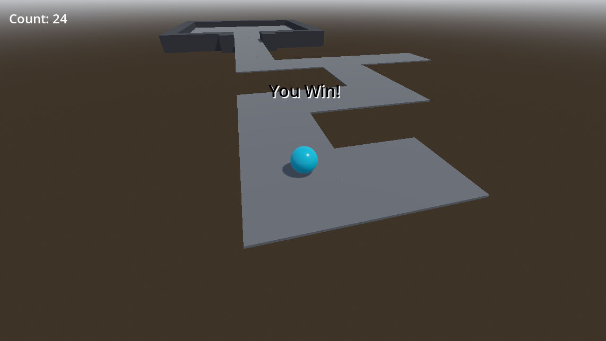

# Medium Priorities

## Camera controls

A static camera is not very good for a 3D game. It's boring. The player should be able to rotate the camera around the player, and look up and down a light bit at least.

Although it's a slightly more advanced topic, Bramwell's [Godot 4 Beginner's tutorial](https://bramwell.itch.io/godot-4-beginners) provided me with a good starting point.

His solution involves adding two nodes on the Player scene that act as pivots: TwistPivot and PitchPivot, then moving the Camera from the Level scene to the PitchPivot node. Finally, he adds a script to the Player that rotates the pivots based on the mouse movement.

That won't be so simple in this case, because the Player is a ball that rolls around, and the camera will follow it, rotating around it. So had to adapt the solution a bit.

The solution I came up with is to keep the camera as a separate scene as it is right now, `levels/game_camera.tscn`, and add the TwistPivot and PitchPivot nodes to it. It will bring only a tiny problem that I'll explain later.

The first step was, on the `Level` scene, to add the GameCamera as local node back to the level scene, right clicking on it and selecting "Make Local".

Next I:
* Renamed the `GameCamera` back to `Camera3D`
* Added a Node3D to the root of the level and renamed it `GameCamera`
* Added another Node3D - TwistPivot - as a child of the `GameCamera`
* Added another Node3d - PitchPivot - as a child of the TwistPivot
* Dettached the `game_camera.gd` script from the Camera3D and attached it to the new `GameCamera` node.
* Finally, I moved the Camera3D to the PitchPivot

Then I saved the new `GameCamera` as `levels/game_camera.tscn` (ovewriting the old one).

One simple change on `game_camera.gd` and I restored the original behaviour:

```gdscript
extends Node3D # <-- was Camera3D
```

Moving on, I started improving the `game_camera.gd` script.

First things first, I added the references and variables I'll need:

```gdscript
@onready var twist_pivot: Node3D = %TwistPivot
@onready var pitch_pivot: Node3D = %PitchPivot

var mouse_sensitivity : float = 0.001
var twist_input : float = 0.0
var pitch_input : float = 0.0
```

Next I changed the mouse mode to captured:

```gdscript
func _ready() -> void:
	Input.set_mouse_mode(Input.MOUSE_MODE_CAPTURED)
    (...)
```

For future reference, I'll change the mnouse mode again when I implement the pause screen using _Input.set_mouse_mode(Input.MOUSE_MODE_VISIBLE)_

Next, I have to store the mouse movement in the `twist_input` and `pitch_input` variables:

```gdscript
func _unhandled_input(event):
	if event is InputEventMouseMotion:
		if Input.get_mouse_mode() == Input.MOUSE_MODE_CAPTURED:
			twist_input = -event.relative.x * mouse_sensitivity
			pitch_input = -event.relative.y * mouse_sensitivity
```

Then, I have to rotate the pivots:

```gdscript
func _process(delta):
    (...)
    twist_pivot.rotate_y(twist_input)
    pitch_pivot.rotate_x(pitch_input)
```

It's important to clamp the pitch rotation to avoid the camera to rotate too much:

```gdscript
    (...)
    pitch_pivot.rotate_x(pitch_input)
	pitch_pivot.rotation.x = clamp(pitch_pivot.rotation.x, 
		deg_to_rad(-10), 
		deg_to_rad(20) 
	)
```

After some experimentation, I found that the values -10 and 20 work well for the pitch rotation.

Finally, I have to reset the values of the `twist_input` and `pitch_input` variables:

```gdscript
func _process(delta):
    (...)

	twist_input = 0 
	pitch_input = 0 
```

It works! The camera rotates around the player, and the player can look up and down a bit.

But as I mentioned before, there's a problem. The camera rotates around the player, but the direction the player is moved is always the same. The problem is in this liune of code:

_player.gd_
```gdscript
func _process(delta: float) -> void:
    (...)
    apply_central_force(input * speed)
```

The apply_central_force() only takes into account the direction of the input, not the direction the player - or the camera - is facing.

Bramwell's provided a solution for it using the [twist_pivot.basis](https://docs.godotengine.org/en/latest/classes/class_node3d.html#class-node3d-property-basis):

```gdscript
# Bramwell's solution
apply_central_force(twist_pivot.basis * input * speed)
```

But in this project, the Player and the GameCamera are in different scenes, so I can't access the `twist_pivot` directly from the Player.

So I had to find a way to access the `twist_pivot` from the Player.

First I added a reference to the GameCamera in the Player:

```gdscript
var game_camera : Node3D
```

Then I set it in the `_ready()` function:

```gdscript
func _ready() -> void:
	game_camera = get_parent().get_node("GameCamera")
```

Since the Player and the GameCamera are siblings on the Level scene, first I get the parent of the Player, which is the Level, and then I get the GameCamera node from it.

Finally, I can use the `game_camera` reference to access the `twist_pivot`:

```gdscript
func _process(delta: float) -> void:
    (...)
    apply_central_force(game_camera.twist_pivot.basis * input * speed)
```

And that fixes the problem! It was a fun exercise.

One positive side effect of this solution is that, since the GameCamera is a separate scene, it won't be difficult to implement the Player's death and respawn. I'll just have to make the GameCamera stop following the Player when it dies, and then detect the new Player and lerp it back to the Player when it respawns.

## Modular Gridmap

The level is very small, and it's not very interesting. It would be nice to have a bigger level, with more pickups and obstacles.

According to the docs, [Gridmap](https://docs.godotengine.org/en/stable/tutorials/3d/using_gridmaps.html) is a tool for creating 3D game levels, similar to the way TileMap works in 2D.

It sounds like a good fit for this project, so I'll give it a try. Once more, Bramwell's course was very helpful to learn how to use it.

The first step is to create a [MeshLibrary](https://docs.godotengine.org/en/stable/classes/class_meshlibrary.html) to store the meshes I'll use to build the level.

I just created a new scene with a Node3D as root and saved it as `levels/tileset.tscn`.

Next I created a MeshInstance as a child of the root, named it `FloorMesh` and set it as a 2.0 x 0.1 x 2.0 BoxMesh. Then I added collision to it using the `Mesh > Create Trimesh Static Body` command.

I did the same with a second MeshInstance, named it `WallMesh` and set it as a 2.0 x 2.2 x 2.0 BoxMesh.

Then I set the same materials I was using for the `Ground` and `Walls` to the `FloorMesh` and `WallMesh` respectively.

To have a better visualisation of the meshes, I set the `WallMesh` transform to `-2.0 x 0.0 x 0.0`.

This was the result:


_(I could have used a smaller, thinner mesh for the Wall and rotate it whenever I needed on the GridMap, but I decided to keep things simple for now and just use a bigger "fits-all" mesh.)_

Next, on the Level scene, I deleted the `Ground` and `Walls` nodes and added a GridMap node as a child of the Level root.

Then I added the `tileset.tscn` to the GridMap's `MeshLibrary` property, and draw the following map, duplicating some pikcups as well:


And voilà! The level is a little more interesting now.


And since I updated the way that the victory condition is checked, I didn't have to worry about those new pickups. It doen't matter how many pickups there are, the player just has to collect all of them to win.



Also, the fact that the player can now rotate the camera around the player makes it easier to navigate the level.

But there are two immediate issues that are bothering me:

* That brownish color of the level's background is not very appealing. I'd like to change it too.
* If the player falls from the level, nothing happens. It would be nice to have a death check and respawn the player at the start of the level.

The first issue was easy to fix. I looked around the options for the `WorldEnvironment` node and found the `Environment > Sky > Sky Material > Ground > Bottom Color` property.


I changed it to a darker blue, and in my opinion it looks better now.


The second issue required some thought, so I decided to fix in the next section.

## Player Death and Respawn

Now that the Level is bigger, it's possible for the player to fall from it. And if that happens, nothing happens. The player just keeps falling forever.

I can think of two ways to fix this:

* Check the player's position and respawn it at the start of the level if it falls below a certain threshold.
* Add an `Area3D` node to the level, and check if the player enters it. If it does, respawn it at the start of the level.

I can think of pros and cons for both approaches.

The first approach is simpler, but I will always have to consider the hardcoded threshold when designing the level. If ever decide to expand the level to a lower level, I'll have to change the threshold as well.

The second approach makes more sense to me. I can add a very, very big `Area3D` node to the level, and if the player falls from the level, it will eventually enter the `Area3D` and trigger the death-respawn sequence. This approach is also flexible enough to allow me to add death traps to the level, like a pit of spikes or a lava pool, even if they're not at the bottom of the level.

I can also combine both approaches. Have the `Area3D` as the main death-respawn trigger, and use the threshold as a fallback in case I forget to add the `Area3D` to a new level or the player manages to find a way to fall from the level without entering the `Area3D`.

Since the level is very simple yet, I'll just go with the second approach for now.

To start, I added a new `Area3D` node to the Level scene and named it `DeathArea`.

Since I plan to make it flexible enough to work with any level, I won't have a default `CollisionShape` as a child of the `DeathArea`. Instead, I'll add for each individual instance of the `DeathArea` node. This way I can have different shapes for each level.

So I right-clicked on the `DeathArea` node and selected `Save Branch as Scene`. Then I saved it as `levels/death_area.tscn`.

I opened the `death_area.tscn` scene and attached a script to it, `death_area.gd`, and added the following code:

```gdscript
extends Area3D


func _ready() -> void:
	body_entered.connect(_on_body_entered)


func _on_body_entered(body : Node3D) -> void:
	if body.name == "Player":
		get_tree().reload_current_scene()
```

For now, I'll just reload the current scene when the player enters the `DeathArea`. I'll add the respawn logic later.

Then I went back to the Level scene and added a `CollisionShape` node as a child of the `DeathArea` node. I set it as a 200.0 x 1.0 x 200.0 BoxShape. Yes, it's a very big box, but it's just a placeholder for now. I can fine tune it later.

Finally, I moved the `DeathArea` node a little bit below the level, setting it's transform to `0.0 x -7.0 x 0.0`.

I tested it, and it worked as expected. If the player falls from the level, the whole scene is reloaded, looking like the player respawned at the start of the level and lost all the pickups it had collected.

## Losing and Restarting the Level

Reloading the whole scene when the player falls from the level is a very, very simple way to implement the death-respawn logic.

It works? Yes. Is it good enough? No. I don't like the fact that the whole scene is immediately reloaded. It's not a very good user experience. The camera just snaps back abruptly to the start of the level. It feels like a hack, not a feature.

It would be much better if the player just respawned at the start of the level, without the scene reloading. The camera could just smoothly move back to the start of the level, and the player would keep the pickups it had collected.

Since it'll involve adding logic to the level itself, I'll implement this idea in the future. Perhaps adding `Player Lives` as well, so the player can have a few tries before having to restart the level.

For now, there's an easier way to improve this situation: adding a "Game Over" message when the player falls from the level, with an option to restart the level or quit the game.

I already have a "You Win!" message, so I'll just add a "You Lose!" message as well, and include buttons to "Restart" and "Quit". I also remember that I'll have to deal with the mouse cursor again, since I always hide it when the game starts.
