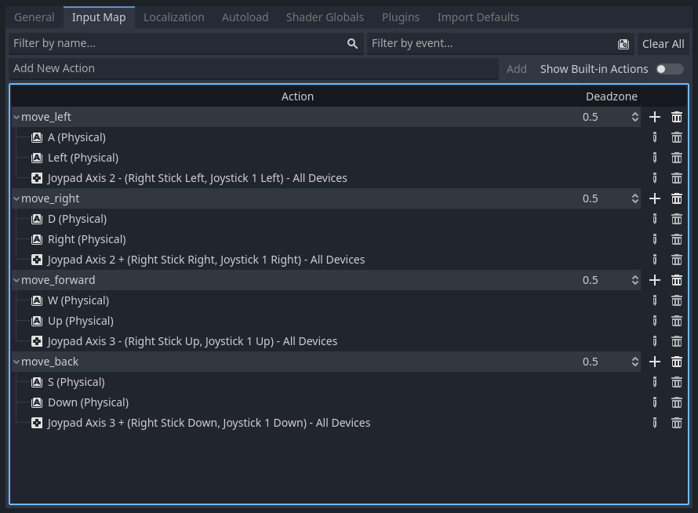

# Moving the Player

The first thing the Unity tutorial does is to add a `Rigidbody` component to the player.

This is the first big difference between Unity and Godot: while in Unity the Rigidbody is a component, in Godot it's a node.

Reading the [Physics introduction](https://docs.godotengine.org/en/latest/tutorials/physics/physics_introduction.html) in the Godot documentation, I found out that there are three types of physics nodes:

* [StaticBody3D](https://docs.godotengine.org/en/latest/classes/class_staticbody3d.html)
* [RigidBody3D](https://docs.godotengine.org/en/latest/classes/class_rigidbody3d.html)
* [CharacterBody3D](https://docs.godotengine.org/en/latest/classes/class_characterbody3d.html)

The `RigidBody3D` is the closest to the Unity `Rigidbody`, so I'll use it.

## Adding the RigidBody3D node

1. Add a RigidBody3D node to the root node
2. Drag the MeshInstance3D node to the RigidBody3D node to make it a child
3. Rename the MeshInstance3D back to MeshInstance3D
4. Reset the Transform property of the MeshInstance3D node back to `0.0, 0.0, 0.0`
5. Rename the RigidBody3D node to `Player`
6. Set the Transform property of the Player node to `0.0, 0.5, 0.0`

Unity's RigidBody has a Collision Detection attribute that is set to Discrete by default, so I presume that is enough for collision detection.

But Godot requires a CollisionShape3D node to be added to the RigidBody3D node to detect collisions. There's even a warning in the RigidBody3D node:

> This node has no shape, so it can't collide or interact with other objects. Consider adding a CollisionShape3D or CollisionPolygon3D as a child to define its shape.

So I added a CollisionShape3D node to the Player node and set its Shape property to SphereShape3D. I checked that both the SphereMesh and the SphereShape3D have a radius of 0.5m.

## Input

The next lessons in the Unity tutorial are about installing Input System package, setting up the input actions and creating a script to move the player.

Again, things are not exactly the same in Godot, but they're very easy to do.

First, I'll create a script to move the player, then I'll set up the input actions.

But before that, I'll organize the project a little bit.

### Saving the player scene

1. Right-click the Player node and select `Save Branch as Scene`
2. Save the scene as `res://player/player.tscn`

### Creating the player script

1. Open the `player.tscn` scene
2. Make sure the Player node is selected and click the `Attach Script` button in the Inspector
3. Save the script as `res://player/player.gd`

This is the default script:

```gdscript
extends RigidBody3D


# Called when the node enters the scene tree for the first time.
func _ready() -> void:
	pass # Replace with function body.


# Called every frame. 'delta' is the elapsed time since the previous frame.
func _process(delta: float) -> void:
	pass
```

The Unity tutorial then presents this code:

```csharp
using System.Collections;
using System.Collections.Generic;
using UnityEngine;
using UnityEngine.InputSystem;

public class PlayerController : MonoBehaviour
{
    private Rigidbody rb;
    private float movementX;
    private float movementY;

    void Start()
    {
        rb = GetComponent<Rigidbody>();
    }

    void OnMove(InputValue movementValue)
    {
        Vector2 movementVector = movementValue.Get<Vector2>();

        movementX = movementVector.x;
        movementY = movementVector.y;
    }

    void FixedUpdate()
    {
        Vector3 movement = new Vector3(movementX, 0.0f, movementY);

        rb.AddForce(movement);
    }
}
```

A few considerations:

* The script stores the `Rigidbody` component in a variable called `rb`. In Godot, the script is attached to the `RigidBody3D` node, so there's no need to store it in a variable. We can use `self` to refer to the node itself.
* The `OnMove` method is called by the Input System package. In Godot, we can use the `_input` method to handle input events.
* The `FixedUpdate` method is called by Unity every fixed framerate frame. In Godot, we can use the `_physics_process` method to handle physics updates. Also, just for the sake of completeness, there's also the Godot's `_process` and Unity's `Update` method, which are called every frame.
* The movement vector is created using the `movementX` and `movementY` variables. In Godot, we can use the `Input.get_axis` method to get the movement vector and store it directly in a Vector3 variable.

A Godot version of the script would be something like this:

```gdscript
extends RigidBody3D


func _ready() -> void:
	pass


func _process(delta: float) -> void:
	var input := Vector3.ZERO 
	input.x = Input.get_axis("move_left", "move_right") 
	input.z = Input.get_axis("move_forward", "move_back") 

	apply_central_force(input)
```

Before testing it, there's a few things to do:

## Input Map

First, I needed to add the `move_left`, `move_right`, `move_forward` and `move_back` actions to the Input Map

It's fairly easy to do:

1. Open the `Project Settings` dialog
2. Open the `Input Map` tab
3. Add the actions
4. Assign the keys

The mapped keys are:


Notice that there are several default actions already defined, like `ui_left`, `ui_right`, `ui_up` and `ui_down`. You can check them by turning on the `Show Built-in Actions` checkbox. We could use them, but I prefer to create my own actions.

Secondly, I needed collision detection added to the Ground mesh, otherwise the player would fall through it.

## Collision Detection on the Ground mesh

I was also easy to do:

1. Select the Ground node
2. Click the Mesh menu
3. Select `Create Trimesh Static Body`

It'll create a `StaticBody3D` node with a `CollisionShape3D` node as children of the Ground node.

Now, if I run the game, I can move the player around the scene using the WASD keys, and it has the same problem as the Unity version: it moves very slowly.

## Player movement speed

