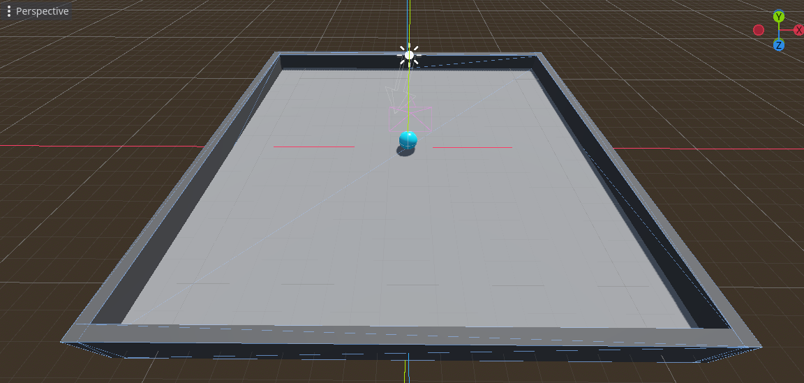

# Setting up the Play Area

Before we start, it became clear to me that the ground plane is still smaller then the Unity version. I'll fix that first.

## Resizing the Ground Plane

1. In the level scene, select the Ground MeshInstance3D node.
2. Open the PlaneMesh resource.
3. Resize the plane to 20m x 20m.

But this creates a new problem: the collision shape is still 10m x 10m. To fix that, I moved the MeshInstance3D node to root, deleted the old StaticBody3D node (now named Ground), and created a new one with the command `Create Trimesh Static Body`. Then I rearranged the nodes so that the MeshInstance3D node is a child of the StaticBody3D node again.

With that done, I can now start adding the walls.

## Adding the first Wall

The Unity's tutorial used an Empty GameObject to hold the walls. I'll do the same here. In Godot, the same thing can be done with a Node3D. I'll add it and rename it as Walls.

Then, add a MeshInstance3D node as a child of Walls. Rename it as Wall. Then, add a BoxMesh resource to it. Resize it to 0.5m x 2m x 20.5m.

Now, add a StandardMaterial to the Wall node. Set its Albedo color to 79 79 79. Metallic is already set to 0.0. Set the Roughness to 0.75.

Before duplicating the wall, we have to make sure it's a StaticBody3D with a CollisionShape. Just like the ground, select the Wall node and run the command `Create Trimesh Static Body`. Finally, rearrange the nodes so that the MeshInstance3D node is a child of the StaticBody3D node.

## Duplicating the Walls

Now that we have the first wall, we can duplicate it to create the other walls. Move and rotate them to create the room. The final result should look like this:
