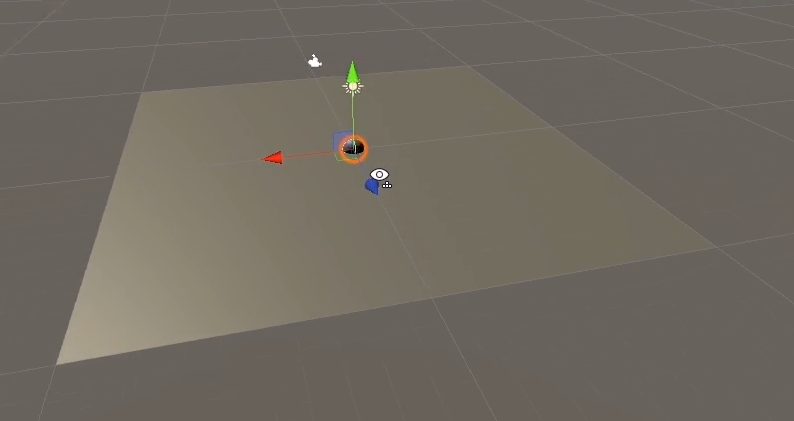
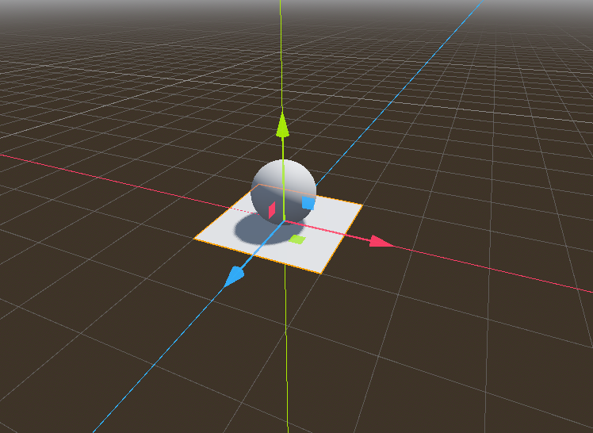
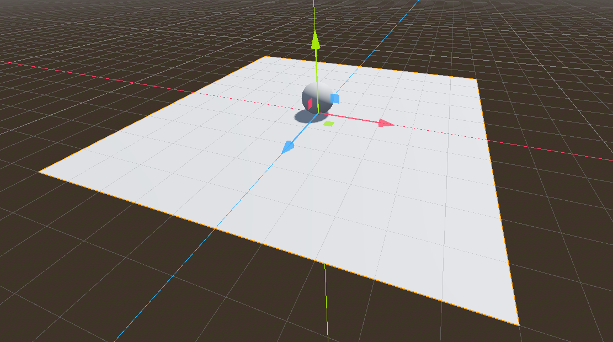
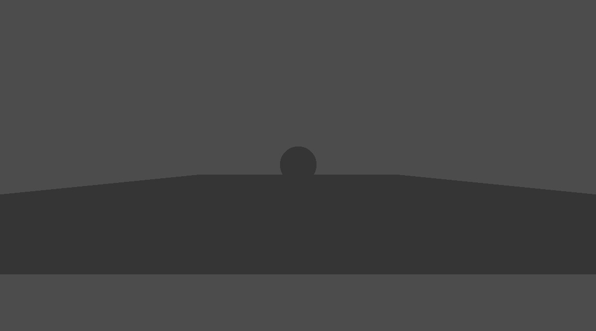
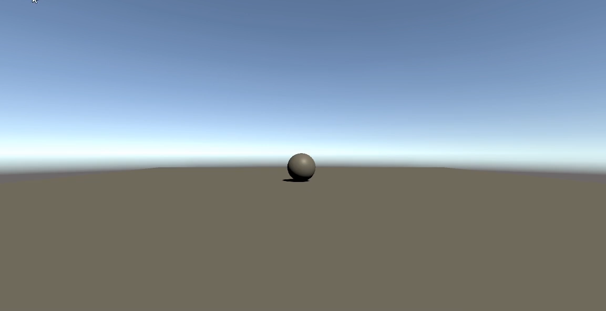
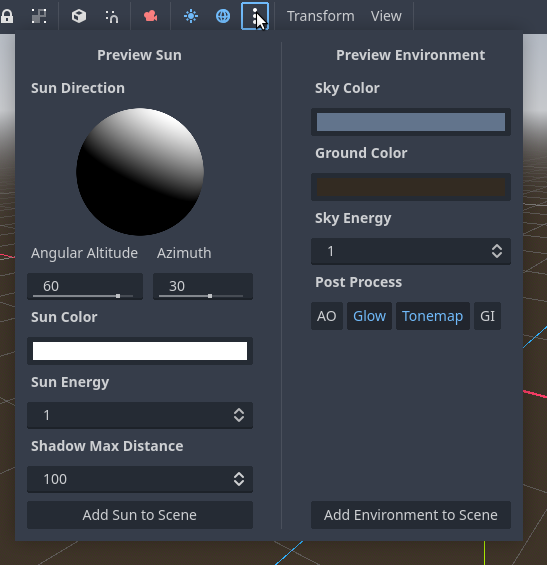
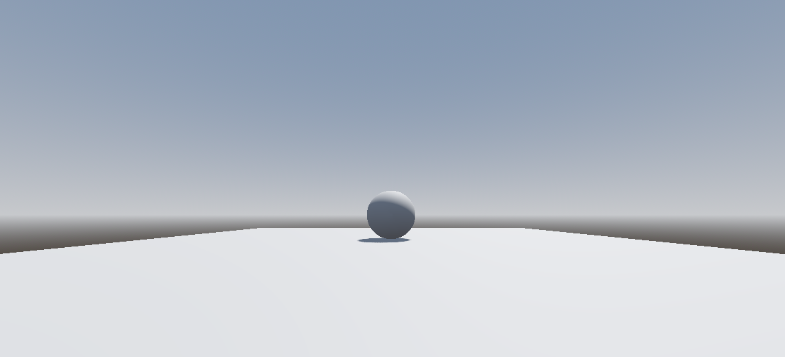
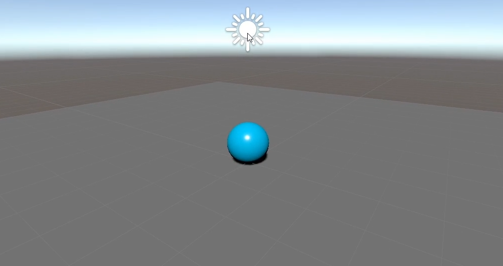
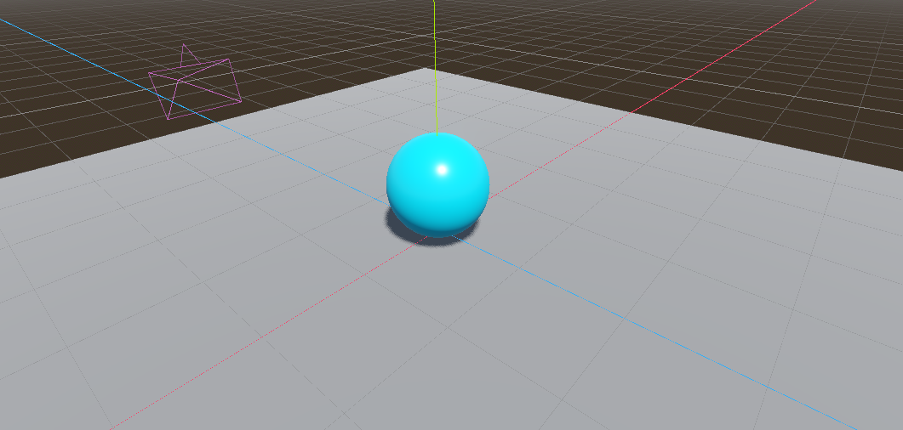

# Setting up

The first lesson of the Unity Roll-a-Ball tutorial are about creating the project, a scene and the ground (a primitive plane).

Things are not exactly the same in Godot, but they are similar enough so far.

## Creating the project

1. Create a new project
2. Select Node3D in the default scene
3. Rename the node to `Level`
4. Save the scene as `res://Levels/level.tscn`

## Creating the ground

1. Add a MeshInstance3D node to the root node
2. In the inspector, add a PlaneMesh to the Mesh property
3. Click the mesh property to open the mesh editor
4. Set the size to 2m x 2m
5. Rename the MeshInstance3D node to `Ground`

## Creating the player

1. Add a MeshInstance3D node to the root node
2. In the inspector, add a SphereMesh to the Mesh property
3. In the Transform property, set the Y value to 0.5m

## Resizing the ground

Now I have a problem: the ground is too small for the sphere when compared to the Unity tutorial.

Unity:

Godot:

I could scale the sphere, but I don't want to do that. I want to keep the sphere at 1m in diameter.

Instead, I decided to scale the ground to 10m x 10m.

10m x 10m ground in Godot:

This is just temporary, since I'll probably change the ground to a [GridMap](https://docs.godotengine.org/pt_BR/latest/tutorials/3d/using_gridmaps.html) later.

## Lighting

Next, the Unity tutorial adjusts the default lighting. I'll do that too.

The only problem is that, according to the Unity tutorial, all new Unity scenes come with a default skybox and a directional light. Godot doesn't.

To demonstrate that, I added a Camera3D node to the root node and set its Transform property to `0.0, 0.5, 6.0` and ran the game.

This was the result:

The Unity scene instead looks like this:

So it's time to add the equivalents of the Unity default skybox and directional light to the Godot scene.

Fortunately, Godot has an easy way to do that: the [Preview environment and sun](https://docs.godotengine.org/en/latest/tutorials/3d/environment_and_post_processing.html#preview-environment-and-sun-low-priority).

The environment and sun preview panel:

That panel contains two useful buttons: `Add Sun to Scene` or `Add Environment to Scene`. They respectively add a `DirectionalLight3D` and a `WorldEnvironment` node to the scene.

The Godot scene now looks like this:

Next the Unity tutorial adjusts the light, setting the color to a pure white. The DirectionalLight3D node has a Light/Color property, and the default sun already has a pure white color, so I don't need to change anything.

## Materials

Next, the Unity tutorial creates a material for the ground and the ball.

1. Select the `Ground` node
2. In the inspector, click the `Surface Material Override` property
3. Add a new `StandardMaterial3D` resource
4. Click on it to expand its properties
5. Set the Albedo color to 130, 130, 130

The metallic (0) and roughness (1) properties seem to be fine at their default values.

By the way, I believe that Unity's smoothness and Godot's roughness are opposites. That's why when Unity's smoothness is 0, Godot's roughness is 1.

Finally, I saved the material as `res://materials/ground.tres`.

I repeated the same steps for the ball, but with an Albedo color of 0, 220, 255 and a roughness of 0.25 (Unity's smoothness was set to 0.75), and I saved the material as `res://materials/ball.tres`.

Unity's scene:

Godot's scene:

The colors are not exactly the same. Maybe a lighting difference? I'll investigate that later.

Now, moving forward to the next lesson: [Moving the player](moving-the-player.md).